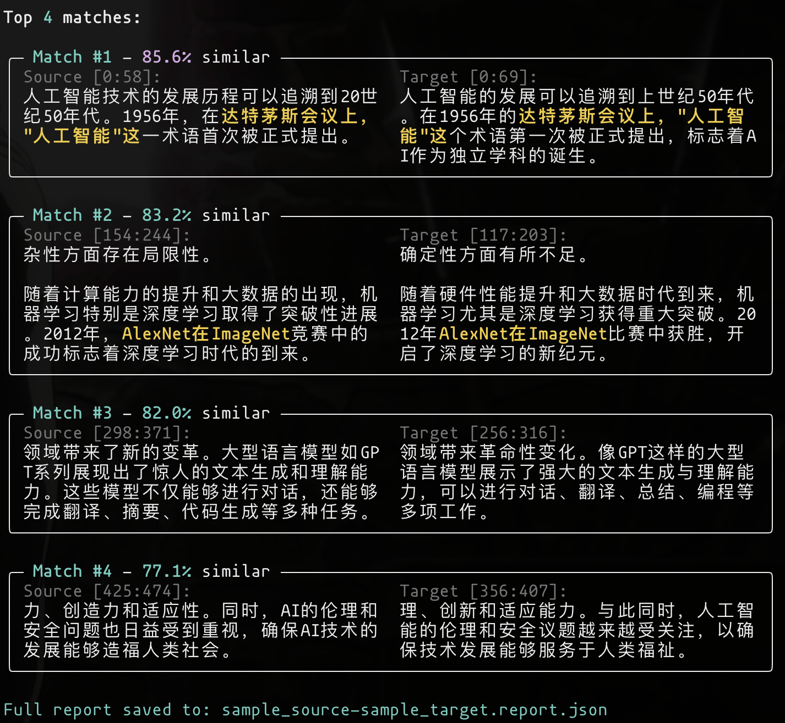

# Plag-Tool

A powerful plagiarism detection tool for Chinese and English text using vector embeddings and semantic similarity.



## Features

- 🌏 **Multilingual Support**: Optimized for both Chinese and English text
- 🔌 **OpenAI-Compatible API**: Works with any OpenAI-compatible embedding service
- 💾 **Vector Database**: Uses ChromaDB for efficient similarity search
- 📊 **Multiple Output Formats**: JSON, HTML, and plain text reports
- 🎯 **Smart Chunking**: Sentence-aware text segmentation for better accuracy
- 💰 **Cost Estimation**: Provides token usage and cost estimates
- ⚡ **Caching**: Built-in embedding cache for improved performance

## Installation

```bash
# Clone the repository
git clone https://github.com/yourusername/plag-tool.git
cd plag-tool

# Create virtual environment
python -m venv venv
source venv/bin/activate  # On Windows: venv\Scripts\activate

# Install the package
pip install -e .
```

## Configuration

Set up your environment variables:

```bash
# Required
export OPENAI_API_KEY="your-api-key-here"

# Optional (with defaults)
export OPENAI_BASE_URL="https://api.openai.com/v1"  # Or your custom endpoint
export OPENAI_MODEL="text-embedding-3-small"         # Or text-embedding-3-large
export CHROMA_PERSIST_DIR="./chroma_db"              # Vector database location
```

Or create a `.env` file based on `.env.example`:

```bash
cp .env.example .env
# Edit .env with your settings
```

## Usage

### Basic Comparison

Compare two files for plagiarism:

```bash
plag-tool compare source.txt target.txt
```

### With Options

```bash
plag-tool compare source.txt target.txt \
  --output report.html \
  --format html \
  --threshold 0.85 \
  --chunk-size 500 \
  --overlap 100
```

### Available Commands

#### `compare` - Main plagiarism detection

```bash
plag-tool compare [OPTIONS] SOURCE_FILE TARGET_FILE

Options:
  -o, --output PATH           Output file path
  -f, --format [json|html|text]  Output format (default: json)
  -t, --threshold FLOAT       Similarity threshold 0-1 (default: 0.85)
  -c, --chunk-size INTEGER    Chunk size in characters (default: 500)
  --overlap INTEGER           Overlap size in characters (default: 100)
  -s, --sentence-boundaries   Use sentence-aware chunking (default: True)
  -v, --verbose              Enable verbose output
  --api-key TEXT             OpenAI API key
  --base-url TEXT            OpenAI base URL
  --model TEXT               Embedding model to use
```

#### `analyze` - Analyze file chunking

Preview how a file will be chunked without running detection:

```bash
plag-tool analyze document.txt --chunk-size 300 --overlap 50

plag-tool compare examples/sample_source.txt examples/sample_target.txt -t 0.75
```

#### `test-connection` - Test API connection

Verify your API configuration:

```bash
plag-tool test-connection
```

#### `quick-compare` - Compare two text strings

Quick similarity check between two text snippets:

```bash
plag-tool quick-compare "First text" "Second text"
```

## Example Output

### JSON Report
```json
{
  "source_file": "essay1.txt",
  "target_file": "essay2.txt",
  "plagiarism_percentage": 42.3,
  "total_matches": 5,
  "matches": [
    {
      "similarity": 0.92,
      "source_text": "...",
      "target_text": "...",
      "exact_matches": ["matching phrase 1", "matching phrase 2"]
    }
  ]
}
```

### HTML Report
The HTML report provides a visual interface with:
- Plagiarism percentage meter
- Side-by-side text comparison
- Highlighted exact matches
- Detection metadata

## API Integration

You can also use the tool programmatically:

```python
from plag_tool.core import Config, PlagiarismDetector

# Configure
config = Config(
    openai_api_key="your-key",
    similarity_threshold=0.85
)

# Detect plagiarism
detector = PlagiarismDetector(config)
report = detector.compare_documents("source.txt", "target.txt")

# Access results
print(f"Plagiarism: {report.plagiarism_percentage:.1f}%")
for match in report.matches:
    print(f"Similarity: {match.similarity:.2f}")
    print(f"Exact matches: {match.exact_matches}")
```

## How It Works

1. **Text Chunking**: Documents are split into overlapping chunks using a sliding window approach
2. **Vectorization**: Each chunk is converted to a vector embedding using OpenAI's API
3. **Similarity Search**: ChromaDB performs efficient similarity search between chunks
4. **Match Detection**: Chunks above the similarity threshold are identified as potential plagiarism
5. **Exact Matching**: Within similar chunks, exact duplicate phrases are extracted
6. **Report Generation**: Results are compiled into a comprehensive report

## Supported Embedding Providers

Any OpenAI-compatible API endpoint:
- OpenAI (api.openai.com)
- Azure OpenAI
- Local embeddings servers (e.g., FastEmbed, Infinity)
- Other compatible services

## Performance Tips

1. **Chunk Size**: Larger chunks (500-1000 chars) work better for general text, smaller chunks (200-300) for technical content
2. **Overlap**: 20-30% overlap helps maintain context at chunk boundaries
3. **Threshold**: 0.85 is good for detecting paraphrasing, 0.95+ for near-exact copies
4. **Caching**: The tool automatically caches embeddings to reduce API calls

## Limitations

- Maximum file size depends on your API rate limits and available memory
- Very short texts (<100 characters) may not produce reliable results
- Heavily modified or translated text may not be detected

## License

MIT License - see LICENSE file for details

## Contributing

Contributions are welcome! Please feel free to submit a Pull Request.
